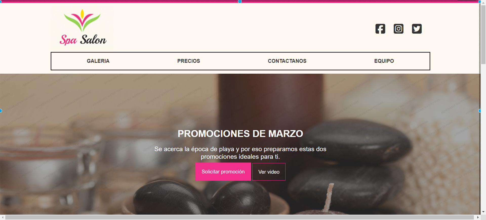
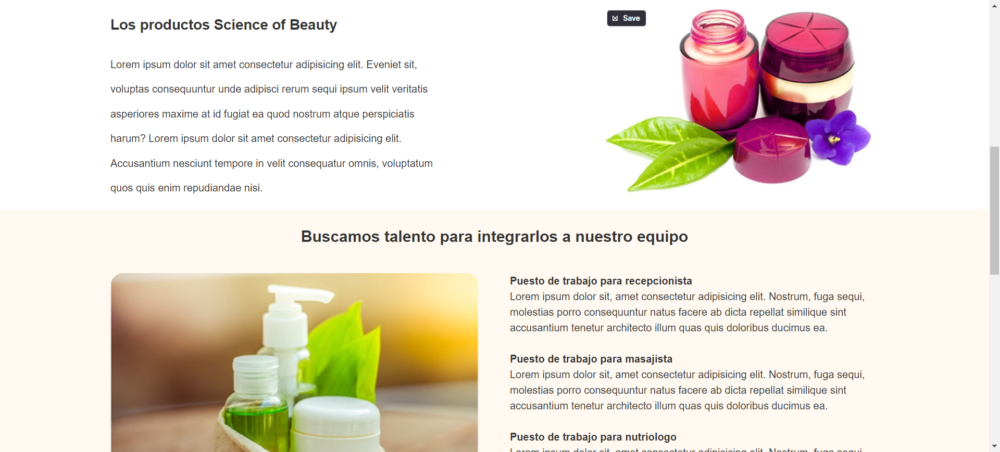
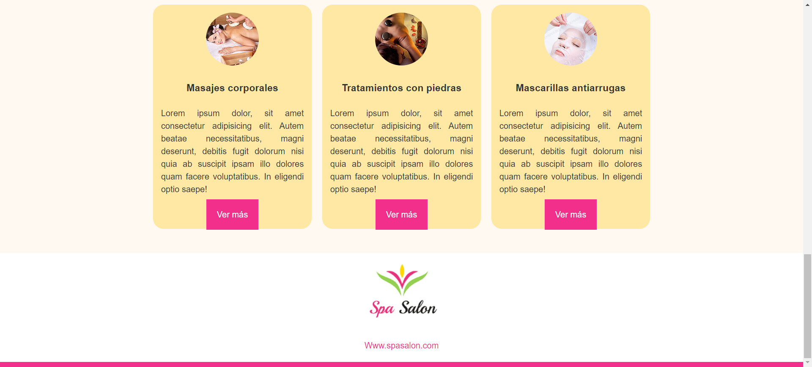

# ONE PAGE DE SPA
Este proyecto fue realizado como parte de las actividades del curso de diseño web de la escuela CECATI 30.
Es un modelo de one page que contiene funciones sencillas como anclas, botones que cambian de color al pasar el cursor y "links" a redes sociales, todo realizado únicamente con HTML Y CSS.
El propósito de este modelo es mostrar los servicios del spa, las redes sociales, los productos y los medios de contacto.

### CAPTURAS DE PANTALLA:

Inicio y promociones:

Productos:

Servicios:

## Tecnologías

Esta página web fue creada con:

* HTML
* CSS

Además, se incluyeron **Google Fonts** para personalizar la fuente y **FontAweosome** para incorporar íconos como flechas y logos de redes sociales populares. 

## Español

El texto de la página web está escrito en español, al igual que las clases y atributos personalizados.

Link a la página: https://vanesolis.github.io/Spa/
